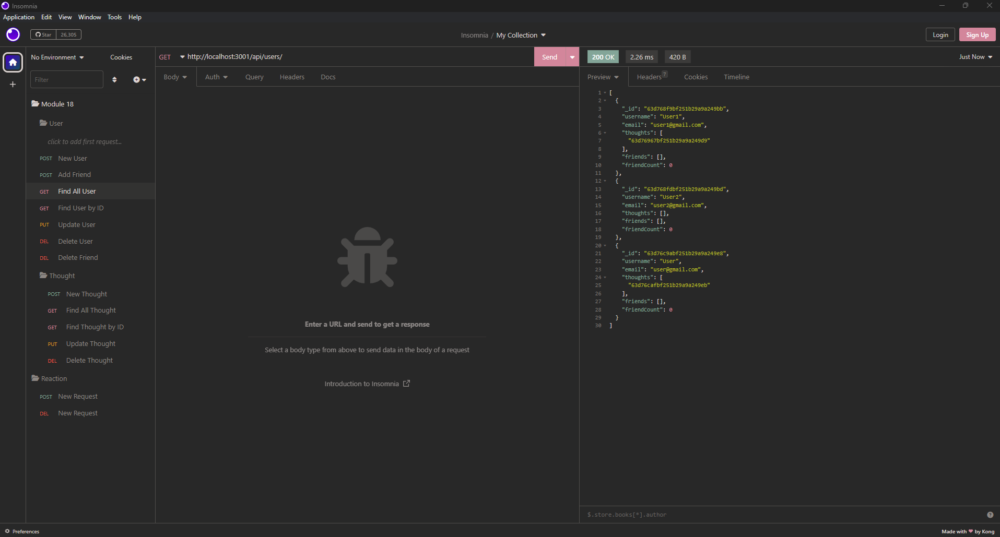

# Social Network API

## Description

This application is an API for a social network that allows for user to create, update, delete users, thoughts, reactions, and add friends.

## Installation

Run ```npm i``` to install modules.

## Screenshot

Below is the sample screenshot of Insomnia



## Walkthrough Video

https://www.youtube.com/watch?v=QoPxxDQNxkU

## Contact

<ul>
    <li><b>Email: </b> <a href="connorcho22@gmail.com">connorcho22@gmail.com</a></li>
    <li><b>Github: </b> <a href="https://github.com/connorcho66">connorcho66</a></li>
    <li><b>Linked In: </b> <a href="www.linkedin.com/in/seongyun-cho-89a8a61a0">SeongYun Cho</a></li>
</ul>
